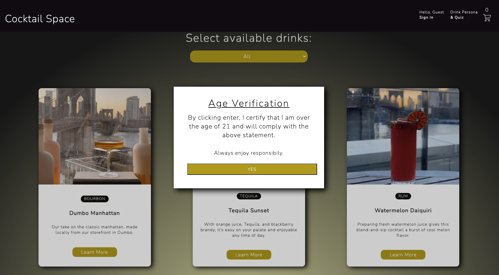

# Cocktail Space

An e-commerce website where you can purchase your favorite drinks!

  
  


## Deployed App

- https://cocktail-space.herokuapp.com/home

## Setup

* clone the repo
* run `npm install`
* Create postgres database (should match the `name`
  parameter in `package.json`):

```
createdb <APP NAME HERE FROM package.json>
```

## Start

Sync and seed your database by running `npm run seed`.

* run `npm run start:dev`

- start:dev will both start your server and build your client side files using webpack
- start:dev:logger is the same as start:dev, but you will see your SQL queries (can be helpful for debugging)
- start:dev:seed will start your server and also seed your database


